# FACULTAD DE INGENIERIA Y ARQUITECTURA               ESCUELA PROFESIONAL DE INGENIERÍA DE SISTEMAS

**IMPLEMENTACIÓN DE UNA PÁGINA WEB PARA LA EMPRESA ASESORÍA ÓPTICA D & R.**

DOCENTE : ING. BERROCAL NAVARRO, RICHARD L.

ORCID : 0000-0001-8718-3150

## Equipo N°3

**Apellidos y Nombres**|**Orcid**|**Participación**
:---:|:---:|:---:
Brito Ruiz, Kimberling Betsayda|orcid.org/0000-0002-1979-8898|100
Damian Solis, Randy Moises| orcid.org/0000-0002-3972-5581| 100
Flores Vives, Víctor Alberto| orcid.org/0000-0002-4094-1281|100
Peña Garcia, Keyla Elisa|orcid.org/0000-0002-3376-4571|100
Salcedo Aranguren, Karen Lizet| orcid.org/0000-0003-0759-1168|100
Zerpa Zegarra Paul Daniel| orcid.org/0000-0003-2209-9032|100

# CONTENIDO DEL TRABAJO

## INTRODUCCION

## INDICE

1. ASPECTOS DE LA ORGANIZACIÓN
    1. Mision
    2. Vision
    3. Objetivos
    4. Antecedentes
    5. Organigrama
    6. Ambito del Proyecto
        1. Area
        2. Recursos Humanos
        3. Software
        4. Hardware
        5. Cronograma de Actividades
2. ASPECTOS DEL NEGOCIO
    1. Problematica Actual o Analisis Situacional
3. METODOLOGIA
    1. Modelo de Requerimientos
        1. Cuadro de requerimientos funcionales, indicando: identificativo, nombre y descripcion.
        2. Cuadro de requerimientos no funcionales, indicando: identificativo, nombre y descripcion.
        3. Relacion de actores y su descripcion.
        4. Relacion de casos de uso.
        5. Modelo de caso de uso de requerimientos.
        6. Plantilla de especificacion de casos de uso.
        7. Matriz de trazabilidad de los requerimientos y casos de uso.
        8. Modelo Conceptual de clases
    2. Analisis Orientado a Objetos
        1. Modelo de Analisis
            1. Diagrama de analisis de clases.
            2. Diagramas de secuencia y colaboracion de analisis.
        2. Lista de Clases de Interfaz.
        3. Lista de Clases de Control.
        4. Lista de Clases de Entidades
        5. Modelo Logico de Clases.
    3. Diseño Orientado a Objetos.
        1. Modelo Fisico.
            1. Creacion de Esquema y Tablas.
        2. Estructura Modular del SWOO.
            1. Diseño de Ventanas.
            2. Diseño de Reportes.
        3. Diagrama de la Capa Presentación.
4. Diagramas de la Capa de Negocio.
        5. Diagrama de la Capa de Datos.
        6. Diagramas de Componentes.
        7. Diagramas de Distribución.

## CONCLUSIONES Y RECOMENDACIONES

## BIBLIOGRAFIA

---

 1. ASPECTOS DE LA ORGANIZACIÓN
    1. Mision

        Prestamos servicios de transporte y logística como operadores integrales atendiendo el mercado nacional e internacional, a través del desarrollo de productos de calidad, proporcionando soluciones globales y a la medida de las necesidades de nuestros clientes.

    2. Vision

        Constituirnos en la empresa líder en el mercado de transporte y logística, desarrollando nuestros recursos humanos y técnicos para alcanzar un alto estándar de calidad y diferenciación en los servicios que brindamos a nuestros clientes.

    3. Objetivos

        **Objetivo General**

        Implementar una página web para un mejor control en el inventario y gestión de ventas en la Asesoría Óptica D & R.

        **Objetivos Específicos**

        1. Analizar la gestión de venta para evitar pérdidas de la Asesoría Óptica D & R.

        2. Crear una base de datos para registrar información de la Asesoría Óptica D & R.

        3. Determinar los requerimientos del cliente para los servicios de la página web en la Asesoría Óptica D & R.

        4. Brindar información básica que debe estar en la página web de la Asesoría Óptica D & R.

    4. Antecedentes

        **a. Antecedentes Nacionales**

        Como un antecedente nacional, según Amanqui, Y. (2020), en su proyecto de Desarrollo e implementación de un aplicativo para mejorar la gestión de mantenimiento en la empresa Lift Parts & Service S.A.C., nos muestra acerca de la idea de implementar y desarrollar una aplicación que perfeccionar el sostenimiento de la entidad Lift Parts & Service SAC.

        Otro proyecto elaborado en Lima-Perú, como el de Huancco, H. (2020), en Desarrollo e implementación de un aplicativo para mejorar la gestión médica de los afiliados en los policlínicos FEBAN, nos muestra acerca de un aplicativo que proporcione múltiples servicios a los empleados de una entidad financiera, para que sus clientes tanto aportantes como pensionistas estén afiliados en FEBAN, un programa de Asistencia Médica Ambulatoria.

        **b. Antecedentes Internacionales**

        Un antecedente internacional en México, según Peña, G. & García, Miguel Eduardo, (2014). En Diseño e implementación de una aplicación web para la gestión de información geográfica del departamento de desarrollo forestal de la CONAFOR Estado de México, nos define que su principal objetivo fue la implantación de una aplicación web que gestione información de datos que tengan vínculo con un programa que desarrolla la Comisión Nacional Forestal - CONAFOR en el ámbito forestal, enfocado en el año 2008 – 2012, visualizando un sistema cartográfico, con surgimiento de consulta de información geoespacial y alfanumérica, con potencial en la gestión de decisiones.

        En el país de Colombia, provincia de Calas encontramos a Ceballos, N. (2016), con su tesis Implementación página web para la empresa Sáner S.A.S., donde nos enseña acerca de la importancia de una implementación de página web empresarial, donde se pueda crear elementos necesarios para la empresa, previa recolección de información de lo requerido, auditado y revisado por el Gerente General.

    5. Organigrama
    

    6. Ámbito del Proyecto
        **a. Área**

        La empresa Asesoría óptica D & R, realiza campañas en muchos lugares estratégicos tales como en el distrito de San Martín de Porres (Av. Perú, óvalo José Granda, Av. Universitaria cruce con la Av. Perú), Lima y en el Callao que es por Mi Perú, Ventanilla, Ciudad del Pescador, Bellavista y bocanegra. Cuando la empresa realiza campañas brinda los servicios, tales como medición de vista, descarte de alteraciones oculares en primer grado, y dependiendo del paciente, se le ofrece la asesoría de monturas para que así el paciente adquiera dicho producto. La Asesoría Óptica D & R, como estrategia se presenta en los mercados, vasos de leche, parques en la que solicita autorización a la Municipalidad o presidentes del sector.

        Dicho a lo anterior, como se podrá apreciar, el negocio no tiene un lugar establecido por más de 72 horas. Sin embargo, su domicilio fiscal está en la Mz. O4, Lt. 11, Ciudad del Pescador, Bellavista, Callao. El centro de operaciones para la realización de los trabajos cuando realiza campañas, es en el centro de lima. Finalmente, como coordinación de equipo para la realización del proyecto, se realizará de forma remota.

        **b. Recursos Humanos**

        “La gestión de los recursos humanos del proyecto incluye los procesos que organizan, gestionan y conducen al equipo del proyecto, que está compuesto por las personas a las que se han asignado roles y responsabilidades para completar el proyecto”. (Granadino, 2016, párr. 3).

        **Rol**|**Apellidos y Nombres**|**Comportamiento**
        ---|---|---
        Gestora de proyecto|Salcedo Aranguren, Karen Lizet|Presentar proyecto al aliado.
        Administrador de Base de Datos| Zerpa Zegarra Paul Daniel| Crear la base de datos
        Programador| Flores Vives Victor Alberto|
        Analista de Sistemas|Brito Ruiz Kimberling Betsayda|
        Calidad de Software| Peña Garcia Keyla Elisa|
        Tester| Damian Solis Randy Moises|

        **c. Software**

        * Microsoft Office Word 2016

            Microsoft Word es un programa completo de procesamiento de texto para los sistemas operativos Windows y Mac.
        * Microsoft Office Excel 2016

            Microsoft Excel es un programa de hojas de cálculo que permite realizar cálculos, contiene herramientas de gráficos, tablas dinámicas y soporte para lenguajes de programación de macros, compatibles con los sistemas operativos de Windows y Mac.
        * Microsoft Office PowerPoint 2016

            Microsoft PowerPoint es un programa de presentación para los sistemas operativos Windows y Mac.
        * Enterprise Architect

            El software Enterprise architect es una plataforma de modelado, diseño y administración colaborativa, basada en UML (Lenguaje Unificado de modelado). Esta plataforma es ágil, intuitiva y extensible, en la que contiene enormes características para dominios específicos.
        * GitHub

            Repositorio online gratuito que permite gestionar proyectos y controlar versiones de código. Es muy utilizado por desarrolladores para almacenar sus trabajos dando así la oportunidad a millones de personas de todo el mundo a cooperar en ellos.
        * Trello

            Trello es una herramienta visual que permite a los equipos gestionar cualquier tipo de proyecto y flujo de trabajo, así como supervisar tareas. Añade archivos, checklists o incluso automatizaciones: personalízalo todo según las necesidades de tu equipo.
        * Microsoft SQL Server Management Studio 18

            SQL Server Management Studio (SSMS para abreviar) es un entorno de desarrollo integrado para administrar cualquier infraestructura SQL. Se utiliza para acceder, administrar, configurar y desarrollar todos los componentes de SQL Server y SQL Database. Microsoft lo ha optimizado a lo largo de los años y es un programa de administración de servidores y bases de datos muy popular.

        d. Hardware

        En este apartado, como equipo hemos determinado lo siguiente:

        Los requerimientos de hardware de la aplicación, tales como:

        * Laptop y computadora

            Desarrollo de la página web

        * Mouse

            Manipulación de los objetos en la pantalla de la laptop y/o computadora

        * Monitor

            Va a mostrar los datos, objetos e información para el desarrollo de la página web.

        * Cámara

            Registrar y capturar las imágenes cuando se realicen las reuniones ya sea con el equipo y aliado del negocio.

        Por la capacidad de respuesta:

        * Celular

            Coordinación con el equipo y pactar las reuniones con el aliado.

        e. Cronograma de Actividades

        |Actividades a Desarrollar |S1|S2|S3|S4|S5|S6|S7|S8|S9|S10|S11|S12|S13|
        |:----|:----|:----|:----|:----|:----|:----|:----|:----|:----|:----|:----|:----|:----|
        |Presentación de la propuesta Inicial del proyecto al representante del negocio||✔||| | | ||| | || |
        |Reunión con el representante legal del negocio.| |✔ | | || | | | | | | | |
        |Recolección de procesos del negocio| | ✔| | | ||| | | | | ||
        |Identificación de los requerimientos del negocio para implementarlos en el proyecto| |✔ | | | | | | | ||| | |
        |Informe – Aspectos de la organización hasta modelo de requerimientos| | |✔ | ✔| | | | | ||| | |
        |Primera muestra del desarrollo del proyecto al asesor.| | | | ✔| | | | | ||| | |
        |Primera prueba de calidad para validar el desarrollo del software| | | | |✔ | | | | ||| | |
        |Reunión con el aliado para el muestreo del Loguin de la página web.| | | | | | ✔| | | ||| | |
        |Segunda prueba del desarrollo del software con todos los miembros del equipo| | | | | | | ✔| | ||| | |
        |Segunda muestra del desarrollo del proyecto parte 2 al asesor.| | | | | | | |✔ | ||| | |
        |Reunión con el aliado para mostrarle las vistas de la página web.| | | | | | | | |✔ ||| | |
        |Última prueba del desarrollo del software con todos los miembros del equipo y validación de la calidad del cumplimiento de objetivos y entregable| | | | | | | | |✔ |✔|✔|✔ | |
        |Entrega FINAL del proyecto al representante del negocio| | | | | | | | | ||| | ✔|

 2. Aspectos del Negocio

    **2.1. Problemática Actual**

    Anteriormente cuando las personas no eran tan exigentes con las características de un producto o servicio, las empresas no sentían la necesidad de mejorar y aumentar la calidad de los productos y servicios, en la actualidad esta representa una de las principales variables en el mercado y es precisamente lo que distingue a las empresas. La calidad es la base para la supervivencia de una empresa, la competitividad y la presencia de clientes cada vez mejor informados.

    El número de ópticas sigue aumentando año tras año. Sin embargo, también existen otros canales sustitutivos de venta que en ocasiones, hacen mucho daño al sector. Un ejemplo es el que comenta Jorge Rubio: “Respecto a las monturas de sol, cerca del 80% son vendidas en locales no autorizados”, “La venta de gafas de sol y graduadas en un todo a cien o la venta por Internet sin ningún tipo de control son prácticas cada vez más frecuentes”.

    Es por esto que ha afectado considerablemente a ASESORÍA ÓPTICA D & R , ya que siendo una empresa que lleva 3 años en el mercado ha sido difícil tener un buen reconocimiento por las personas.

    Pero con la incursión de nuevos ofertantes, las empresas comenzaron a crear sus características distintivas de la competencia. Es decir aumentar su calidad de servicio y crear diferenciadores para fidelizar clientes. En el caso de ASESORÍA ÓPTICA D & R, no solo se trata de aumentar la calidad en el servicio sino también en saber aprovechar las nuevas herramientas que ofrece el Internet para incursionar en los nuevos mercados y atraer nuevos clientes, diferenciándose de los demás establecimientos ópticos.

    El sector óptico es un sector maduro, caracterizado por una fuerte competencia en precios, donde una excelente atención al cliente es fundamental para el éxito de ASESORÍA ÓPTICA D & R, y con la incursión del Internet como herramienta importante para mercadear y promocionar productos y servicios, es allí donde ASESORÍA ÓPTICA D & R presenta falencias, aunque conoce su desventaja con ciertos competidores respecto al uso del Internet, aún no cuenta con una plataforma web digital que le ayude a posicionarse en el mercado y mejorar su relación con los clientes.

    ASESORÍA ÓPTICA D & R, decide en su afán por ser competitiva hacer uso de las herramientas que ofrece el Internet como redes sociales (facebook y twitter), sin tener un rumbo y estrategias que la orienten a su objetivo de abarcar un nuevo mercado y ser competitiva. ASESORÍA ÓPTICA D & R, ha realizado pequeñas inversiones en marketing y publicidad, como volanteo, rediseño de la imagen corporativa como tarjetas de presentación, portafolio de productos y servicios, papelería membretada, sin tener presente si habrá un retorno a esa inversión, si captó nuevos clientes o las ventas aumentaron debido a la inversión.

 3. Metodología

    **3.1. Modelo de Requerimientos**

    **3.1.1. Cuadro de Requerimientos Funcionales**

    **Identificador**|**Nombre**|**Descripción**
     :---:|:---:|:---:
    RF1|Pagina web para un mejor control|Nuestra pagina web ofrecera a los clientes un mejor control en el inventario y a la gestion de ventas so bre lso productos que la empresa ofrece
    RF2|Solicitar Pedido| Nuestra pagina web esta capacitada para poder almacenar todos los datos que ingresará el cliente
    RF3|Registrar Paciente|Nuestra pagina web se registraran los datos especificos del pedido(cantidad, tipo de producto,etc.) y también los datos personales del paciente para poder realizar el registro
    RF4|Registrar atención|El control de producción sera verificado con el formulario que el cliente llenó al inicio de todo el proceso

    **3.1.2. Cuadro de Requerimientos No Funcionales**

    **Identificador**|**Nombre**|**Descripción**
    :---:|:---:|:---:
    RNF1|Uso Factible|Nuestra pagina web no es complicada en cuanto al manejo de nuestros clientes
    RNF2|Adquiere Herramientas|Para el exito de Asesoria Optica D & R a traves del uso del internet como herramienta importante para mercadear y promocionar productos y/o servicios
    RNF3|Software|El software para el desarrollo del modelamiento sera Enterprise Architect
    RNF4|Base de Datos|El gesto de base de datos que se brindara es Microsoft SQL Server Management Studio 18

    **3.1.3. Relacion de actores y su descripción**

    **Actor**|**Asignado a**|**Responsabilidades**
    :---:|:---:|:---:
    Cliente|Realizar Registro/Reservar Cita/Visualizar Productos|El cliente solicita el servicio mediante llamada telefónica, Whatsapp o pagina web brindando sus datos e informacion personal requerida.

    **3.1.4. Relación de casos de uso**

    **Nro.** | **Caso de Uso** | **Descripción**
    :---:|:---:|:---:
    CUN01|Realizar registro|Para este caso de uso de negocio se necesita registra de manera óptima a un cliente para así poder brindar diversas funcionalidades al cliente en beneficio de ambos.
    CUN02|Reservar Cita|En este caso de uso de negocio el cliente solicita al sistema la reserva de una cita, obteniendose como respuesta la seleccion de fecha y hora disponibles de acuerdo a conveniencia del cliente.
    CUN03|Visualizar productos|El cliente interactua con el sistema, observandose diversos productos de interes, del cual el mismo podra obtener información de las diferentes caracteristicas de los productos mostrados.

    **3.1.5. Modelo de Caso de Uso de Requerimientos**

    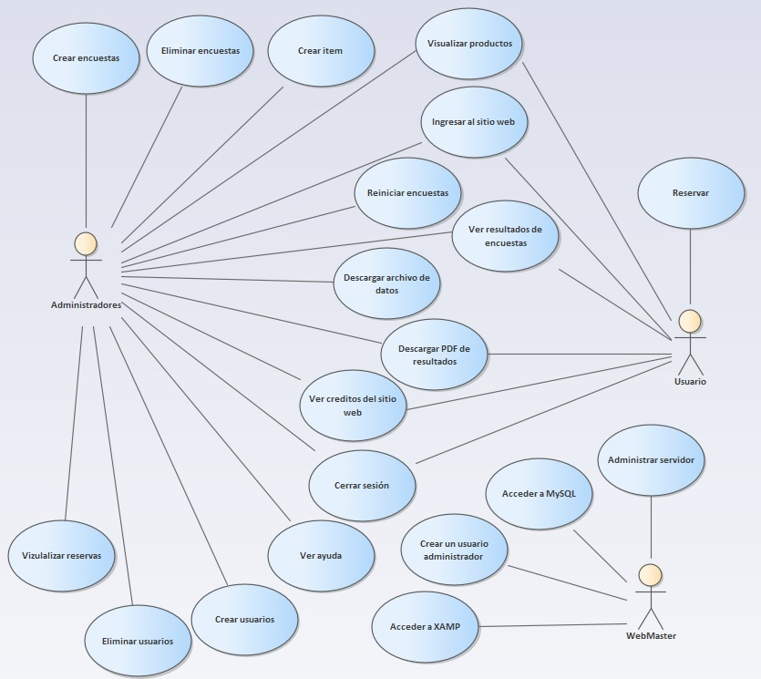

    **3.1.6. Plantilla de Especificación de Caso de Uso**

    Caso de uso|Pagina web para empresa Asesoria Optica D & R
    :---:|:---:
    Actores|Administradores, usuario, Webmaster
    Tipo|Primario
    Referencias|CUN01,CUN02,CUN03
    Precondición|Ninguna
    Postcondición|El sitio web tendrá un foro de ayuda al usuario
    Autores|Grupo3
    Proposito|Ayudar a la Empresa asesoría óptica D&R.
    Resumen|El usuario podrá interactuar con una página web donde habrán encuestas, información de la empresa, precios, etc.

    **3.1.7. Matriz de trazabilidad de los requerimientos y casos de uso**

***Matriz de trazabilidad de los requerimientos de sistema***

|Requerimientos|Prioridad|Estado|Dificultad|Asignado a|
|:----|:----|:----|:----|:----|
|CUS1: Registrar logueo|Alta|Propuesto|Media|Administrador|
|CUS2: Registrar cliente|Alta|Propuesto|Media|Administrador|
|CUS3: Realizar catálogo|Media|Propuesto|Alta|Adminstrador|
|CUS4: Registrar empleado|Media|Propuesto|Media|Administrador|
|CUS5: Registrar diagnóstico|Media|Propuesto|Media|Optómetra|
|CUS6: Registrar citas|Media|Propuesto|Media|Recepcionista|
|CUS7: Generar ficha de atención|Media|Propuesto|Media|Recepcionista|
|CUS8: Registrar productos|Alta|Propuesto|Media|Administrador|
|CUS9: Registrar ventas|Alta|Propuesto|Media|Administrador|
|CUS10: Consultar catálogo|Media|Propuesto|Media|Cliente|
|CUS11: Realizar pedido|Media|Propuesto|Media|Cliente|
|CUS12: Generar reportes|Baja|Propuesto|Alta|Administrador|
|CUS13: Generar comprobantes de pago|Media|Propuesto|Media|Recepcionista|
|CUS14: imprimir documentos|Baja|Propuesto|Media|Recepcionista|
|CUS15: Generar ficha de atención|Media|Propuesto|Media|Recepcionista|
|CUS16: Realizar inventario|Alta|Propuesto|Alta|Administrador|

***Matiz de trazabilidad de casos de uso y actores***

|Relaciones |CUS1: Registrar logueo|CUS2: Registrar cliente|CUS3: Realizar catálogo|CUS4: Registrar empleado|CUS5: Registrar diagnóstico|CUS6: Registrar citas|CUS7: Generar ficha de atención|CUS8: Registrar productos|CUS9: Registrar ventas|CUS10: Consultar catálogo|CUS11: Realizar pedido|CUS12: Generar reportes|CUS13: Generar comprobantes de pago|CUS14: imprimir documentos|CUS15: Generar ficha de atención|CUS16: Realizar inventario|
|:----|:----|:----|:----|:----|:----|:----|:----|:----|:----|:----|:----|:----|:----|:----|:----|:----|
|ACT1: Administrador|✔|✔|✔|✔| | | |✔|✔| | |✔| | | |✔|
|ACT2: Optómetra| | | | |✔| | | | | | | | | | | |
|ACT3: Recepcionista| | | | | |✔|✔| | | | | |✔|✔|✔| |
|ACT4: Cliente| | | | | | | | | |✔|✔| | | | | |

3.1.8. Modelo Conceptual de clases

[](https://postimg.cc/VrpW6FqR)

3.2. Analisis Orientado a Objetos

3.2.1.2. Diagramas de Secuencia y Colaboración de Análisis

* Realizar Registro

 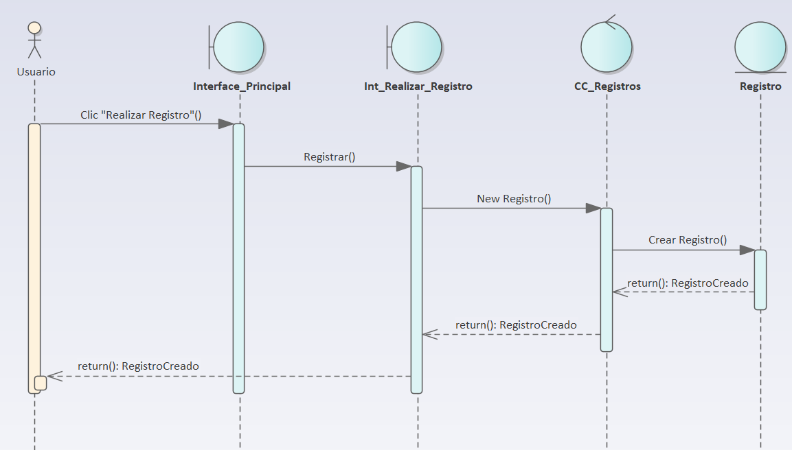

* Reservar Cita

 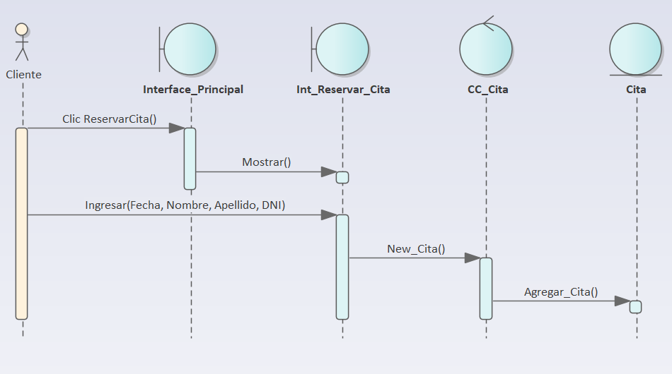

3.2.2. Lista de Clases de Interfaz

* Interface Login
* Interface Principal
* Interface Usuarios
* Interface Reservas
* Interface Compras
* Interface Clientes
* Interface Productos
* Interface Proveedor
* Interface Detalle Productos
* Interface Detalle Ventas
* Interface Detalle Compras

3.2.3. Lista de Clases de Control

* Controlador Login
* Usuario Controlador
* Reserva Controlador
* Compras Controlador
* Cliente Controlador
* Producto Controlador

3.2.4. Lista de Clases de Entidades

* Producto
* Proveedor
* Cliente
* Venta
* Compra
* Cita
* Rol
* Empleado
* Marca
* Categoria

3.2.5. Modelo Lógico de Clases

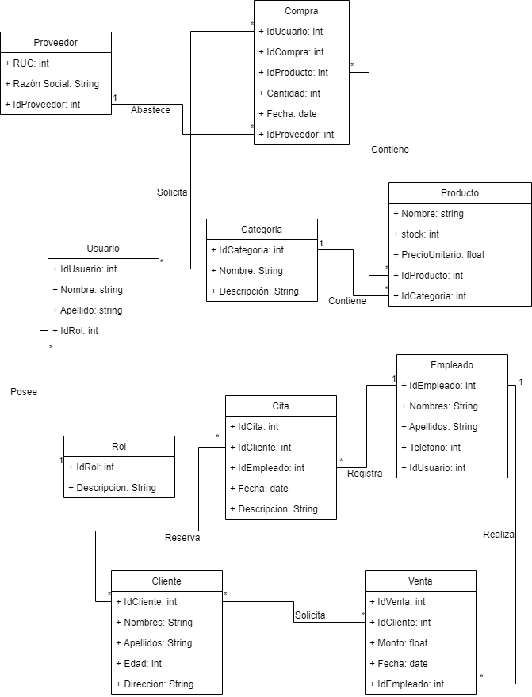

3.3. Diseño Orientado a Objetos

3.3.1. Modelo Fisico

3.3.1.1. Creación del Esquema y Tablas

```sql
go
use master
go
IF NOT EXISTS(SELECT name FROM master.dbo.sysdatabases WHERE NAME = 'BDD_OPTICA')
CREATE DATABASE BDD_OPTICA
GO 

USE BDD_OPTICA
GO

--(1) TABLA ROL
if not exists (SELECT * FROM INFORMATION_SCHEMA.TABLES WHERE TABLE_SCHEMA = 'dbo' AND TABLE_NAME = 'ROL')
create table ROL(
IdRol int primary key identity(1,1),
Descripcion varchar(60),
Activo bit default 1,
FechaRegistro datetime default getdate()
)
GO

--(2) TABLA OPTICA
if not exists (SELECT * FROM INFORMATION_SCHEMA.TABLES WHERE TABLE_SCHEMA = 'dbo' AND TABLE_NAME = 'OPTICA')
create table OPTICA(
IdTienda int primary key identity(1,1),
Nombre varchar(60),
RUC varchar(60),
Direccion varchar(100),
Telefono varchar(50),
Activo bit default 1,
FechaRegistro datetime default getdate()
)
GO

--(3) TABLA MENU
if not exists (SELECT * FROM INFORMATION_SCHEMA.TABLES WHERE TABLE_SCHEMA = 'dbo' AND TABLE_NAME = 'MENU')
create table MENU(
IdMenu int primary key identity(1,1),
Nombre varchar(60),
Icono varchar(60),
Activo bit default 1,
FechaRegistro datetime default getdate()
)
GO

--(4) TABLA SUBMENU
if not exists (SELECT * FROM INFORMATION_SCHEMA.TABLES WHERE TABLE_SCHEMA = 'dbo' AND TABLE_NAME = 'SUBMENU')
create table SUBMENU(
IdSubMenu int primary key identity(1,1),
IdMenu int references MENU(IdMenu),
Nombre varchar(60),
Controlador varchar(60),
Vista varchar(50),
Icono varchar(50),
Activo bit default 1,
FechaRegistro datetime default getdate()
)
GO

--(5) TABLA USUARIO
if not exists (SELECT * FROM INFORMATION_SCHEMA.TABLES WHERE TABLE_SCHEMA = 'dbo' AND TABLE_NAME = 'USUARIO')
create table USUARIO(
IdUsuario int primary key identity(1,1),
Nombres varchar(60),
Apellidos varchar(60),
Correo varchar(60),
Clave varchar(100),
IdTienda int references OPTICA(IdTienda),
IdRol int references ROL(IdRol),
Activo bit default 1,
FechaRegistro datetime default getdate()
)
GO

--(6) TABLA PERMISOS
if not exists (SELECT * FROM INFORMATION_SCHEMA.TABLES WHERE TABLE_SCHEMA = 'dbo' AND TABLE_NAME = 'PERMISOS')
create table PERMISOS(
IdPermisos int primary key identity(1,1),
IdRol int references ROL(IdRol),
IdSubMenu int references SUBMENU(IdSubMenu),
Activo bit default 1,
FechaRegistro datetime default getdate()
)
go
--(7) TABLA PROVEEDOR
if not exists (SELECT * FROM INFORMATION_SCHEMA.TABLES WHERE TABLE_SCHEMA = 'dbo' AND TABLE_NAME = 'PROVEEDOR')
create table PROVEEDOR(
IdProveedor int primary key identity(1,1),
RUC varchar(50),
RazonSocial varchar(100),
Telefono varchar(50),
Correo varchar(50),
Direccion varchar(50),
Activo bit default 1,
FechaRegistro datetime default getdate()
)
go

--(8) TABLA CATEGORIA
if not exists (SELECT * FROM INFORMATION_SCHEMA.TABLES WHERE TABLE_SCHEMA = 'dbo' AND TABLE_NAME = 'CATEGORIA')
create table CATEGORIA(
IdCategoria int primary key identity(1,1),
Descripcion varchar(100),
Activo bit default 1,
FechaRegistro datetime default getdate()
)
go


--(8) TABLA PRODUCTO
if not exists (SELECT * FROM INFORMATION_SCHEMA.TABLES WHERE TABLE_SCHEMA = 'dbo' AND TABLE_NAME = 'PRODUCTO')
create table PRODUCTO(
IdProducto int primary key identity(1,1),
Codigo varchar(100),
ValorCodigo int,
Nombre varchar(100),
Descripcion varchar(100),
IdCategoria int references CATEGORIA(IdCategoria),
Activo bit default 1,
FechaRegistro datetime default getdate()
)
go


--(8) TABLA PRODUCTO_OPTICA
if not exists (SELECT * FROM INFORMATION_SCHEMA.TABLES WHERE TABLE_SCHEMA = 'dbo' AND TABLE_NAME = 'PRODUCTO_OPTICA')
create table PRODUCTO_OPTICA(
IdProductoTienda int primary key identity(1,1),
IdProducto int references PRODUCTO(IdProducto),
IdTienda int references OPTICA(IdTienda),
PrecioUnidadCompra decimal(18,2) default 0,
PrecioUnidadVenta decimal(18,2) default 0,
Stock bigint default 0,
Activo bit default 1,
Iniciado bit default 0,
FechaRegistro datetime default getdate()
)
go

--(9) TABLA COMPRA
if not exists (SELECT * FROM INFORMATION_SCHEMA.TABLES WHERE TABLE_SCHEMA = 'dbo' AND TABLE_NAME = 'COMPRA')
create table COMPRA(
IdCompra int primary key identity(1,1),
IdUsuario int references USUARIO(IdUsuario),
IdProveedor int references PROVEEDOR(IdProveedor),
IdTienda int references OPTICA(IdTienda),
TotalCosto decimal(18,2) default 0,
TipoComprobante varchar(50) default 'Boleta',
Activo bit default 1,
FechaRegistro datetime default getdate()
)
go

--(10) TABLA DETALLE_COMPRA
if not exists (SELECT * FROM INFORMATION_SCHEMA.TABLES WHERE TABLE_SCHEMA = 'dbo' AND TABLE_NAME = 'DETALLE_COMPRA')
create table DETALLE_COMPRA(
IdDetalleCompra int primary key identity(1,1),
IdCompra int references COMPRA(IdCompra),
IdProducto int references Producto(IdProducto),
Cantidad int,
PrecioUnitarioCompra decimal(18,2),
PrecioUnitarioVenta decimal(18,2),
TotalCosto decimal(18,2),
Activo bit default 1,
FechaRegistro datetime default getdate()
)
go

-- (10) TABLA CLIENTE
if not exists (SELECT * FROM INFORMATION_SCHEMA.TABLES WHERE TABLE_SCHEMA = 'dbo' AND TABLE_NAME = 'CLIENTE')
create table CLIENTE(
IdCliente int primary key identity(1,1),
TipoDocumento varchar(50),
NumeroDocumento varchar(50),
Nombre varchar(50),
Direccion varchar(50),
Telefono varchar(40),
Activo bit default 1,
FechaRegistro datetime default getdate()
)
go 

-- (11) TABLA VENTA
if not exists (SELECT * FROM INFORMATION_SCHEMA.TABLES WHERE TABLE_SCHEMA = 'dbo' AND TABLE_NAME = 'VENTA')
create table VENTA(
IdVenta int primary key identity(1,1),
Codigo varchar(100),
ValorCodigo int,
IdTienda int references OPTICA(IdTienda),
IdUsuario int references USUARIO(IdUsuario),
IdCliente int references CLIENTE(IdCliente),
TipoDocumento varchar(50),
CantidadProducto int,
CantidadTotal int,
TotalCosto  decimal(18,2),
ImporteRecibido decimal(18,2),
ImporteCambio decimal(18,2),
Activo bit default 1,
FechaRegistro datetime default getdate()
)
go

-- (12) TABLA DETALLE_VENTA
if not exists (SELECT * FROM INFORMATION_SCHEMA.TABLES WHERE TABLE_SCHEMA = 'dbo' AND TABLE_NAME = 'DETALLE_VENTA')
create table DETALLE_VENTA(
IdDetalleVenta int primary key identity(1,1),
IdVenta int references VENTA(IdVenta),
IdProducto int references PRODUCTO(IdProducto),
Cantidad int,
PrecioUnidad decimal(18,2),
ImporteTotal decimal(18,2),
Activo bit default 1,
FechaRegistro datetime default getdate()
)
go
```

3.3.2 Estructura Modular del SWOO

3.3.2.1. Diseño de Ventanas

* Ventana Principal

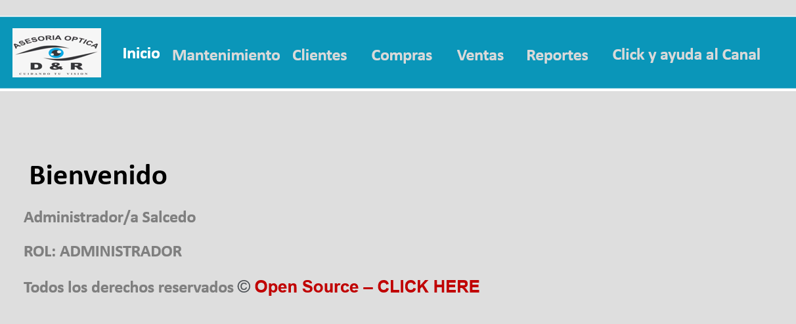

* Ventana Categorias

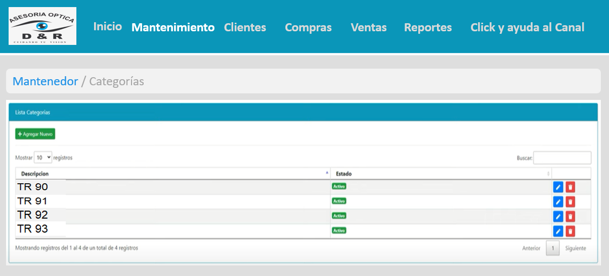

* Ventana Clientes

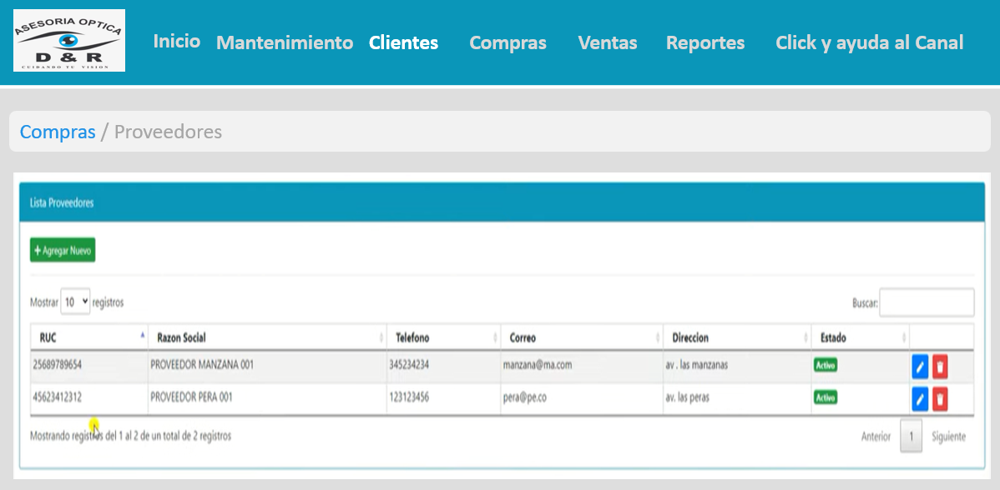

* Ventana Registrar Compra

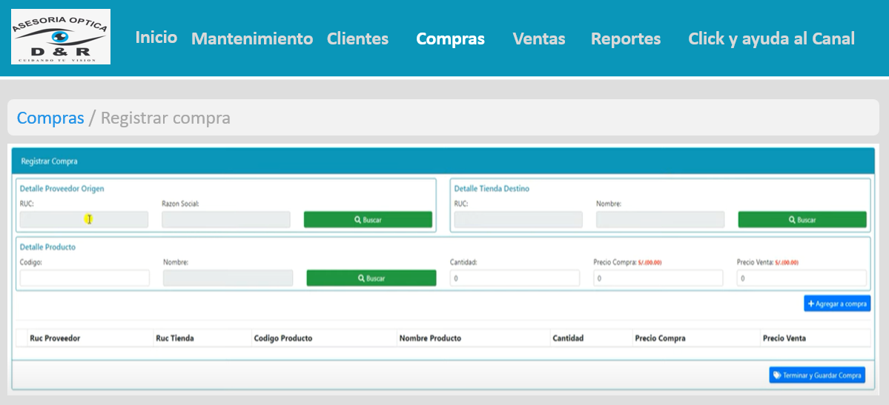

* Ventana Rol

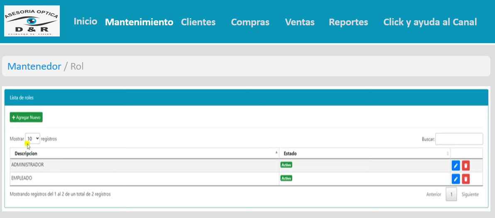

* Ventana Login

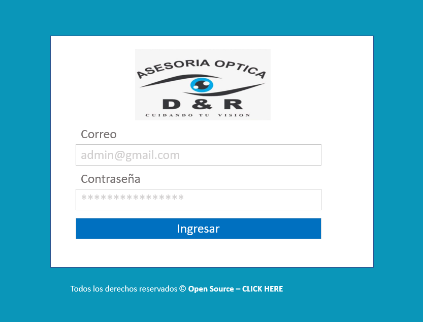

* Ventana Permisos

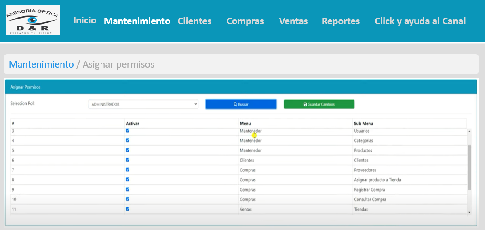

3.3.2.2. Diseño de Reportes

* Reportes Productos Tienda

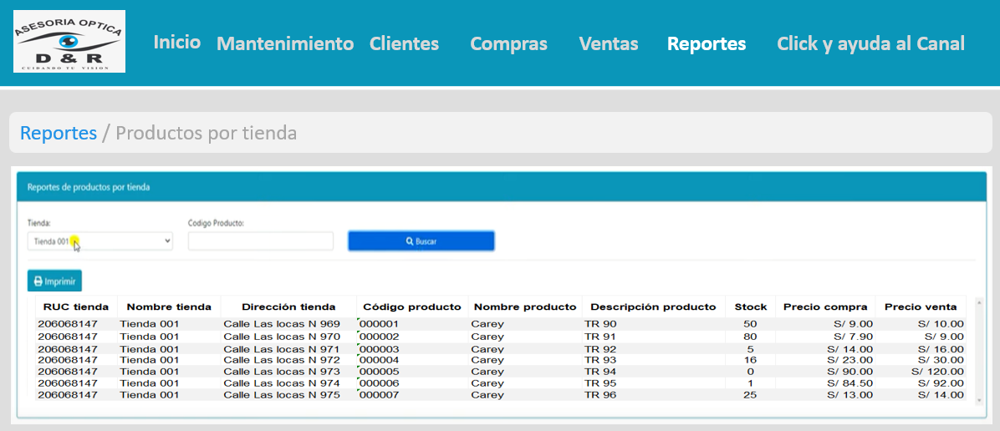

* Reportes Productos

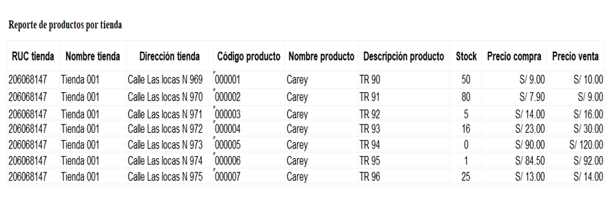

3.3.3 Diagrama de la Capa de Presentación

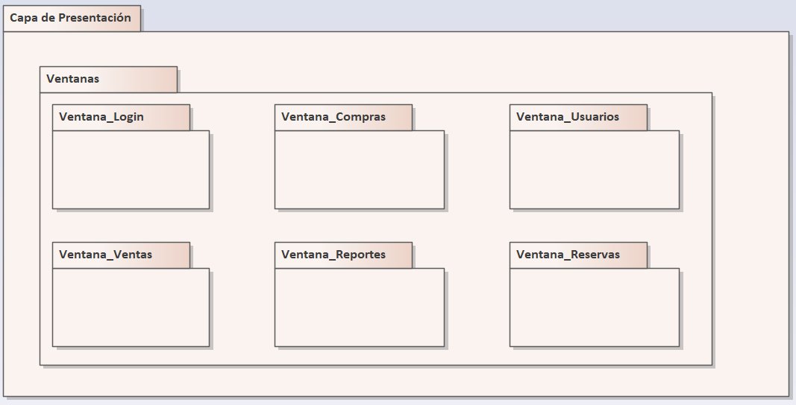

3.3.4. Diagrama de la Capa de Negocio

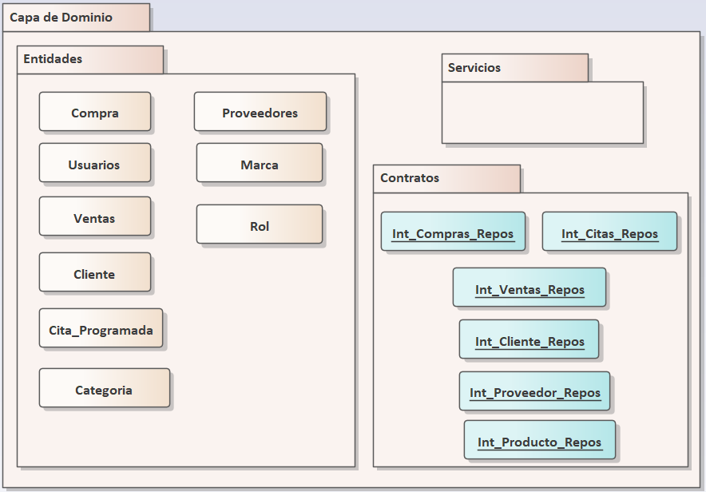

3.3.5. Diagrama de la Capa de Datos


CONCLUSIONES Y RECOMENDACIONES

Es importante que “EMPRESA ASESORÍA ÓPTICA D & R”, haya visualizado y analizado las tendencias del mercado, que es cambiante, para así poder tomar decisiones estratégicas de mercadeo digital que ayuden en su gestión de buscar nuevos segmentos al cual dirigirse, la impulsen a destacarse y sobresalir en el mercado, con la realización del análisis del mercado óptico en internet, la Empresa pudo identificar las diferentes estrategias implementadas por la competencia, y basándose en ello, poder implementar sus propias estrategias para no solo aparecer en internet, si no también aumentar su posicionamiento ya que con la información recopilada en esta investigación, se logró dimensionar el valor de las herramientas y aplicaciones que ofrece Internet como redes sociales integradas a un sitio web, dinamizando los servicios del sector óptico, por medio de estrategias de contenido bien estructuradas despertando el interés de los usuarios, para ello se debe analizar los beneficios que ofrece, y poderlos integrar según las necesidades y requerimientos que tiene la empresa a la hora de optar por un software que lo permita.
Empresa Asesoria Óptica D & R, es una empresa en crecimiento y por eso es importante la implementación de una página web, que ayude en su labor diaria, mejorando las relaciones con los clientes, potencializando su mercado y tipificando los clientes según sus necesidades y requerimientos.  Los indicadores de gestión aportan valor a la gestión de implantar una plataforma digital en Empresa Asesoria Óptica D & R, ya que por medio de estos se mide el rendimiento y se obtienen los resultados según los objetivos planteados por la Empresa.

* Evidentemente el Internet ha facilitado el acceso a la información de forma eficaz, es por ello que Empresa Asesoria Óptica D & R, debe seguir haciendo uso efectivo de las tecnologías de la comunicación, brindando a los clientes mayor calidad en el servicio que ofrece la Empresa, ya que con el buen uso de esta herramienta se puede obtener un mayor posicionamiento a raíz de una excelente administración que se debe tener.

* Se recomienda diseñar una estrategia de publicidad y promoción tanto para la página web y redes sociales, como para la plataforma digital, incentivando la participación y el interés de los usuarios en los diferentes espacios de interacción que Empresa Asesoria Óptica D & R brinda.

* Realizar las respectivas mediciones de cada aplicación periódicamente, para tener información relevante en cifras, datos, gráficas, etc., que soporte la evolución de dichas aplicaciones, por medio del análisis e interpretación oportuna de los resultados, para la toma de decisiones.

* Establecer un área de mercadeo que brinde soporte y apoyo a todas las labores desarrolladas en la Empresa.
